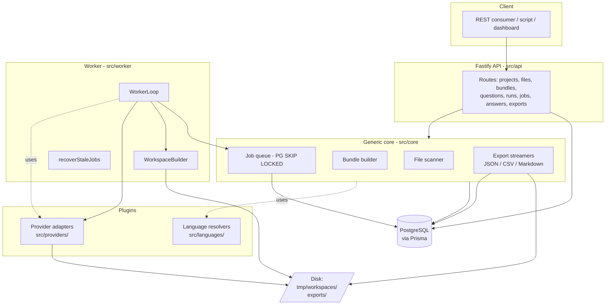
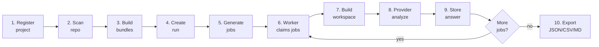
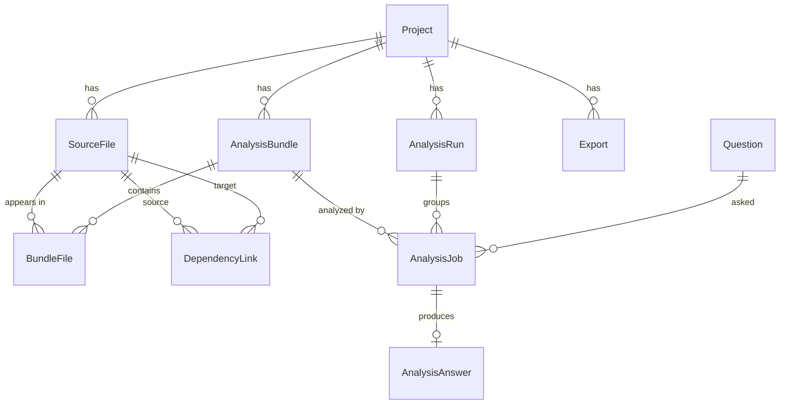
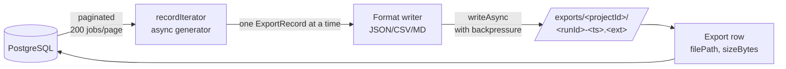

# codebase-analysis-orchestrator

A backend orchestration system that turns a large source repository into a
**queue of small, traceable, AI-driven analysis jobs** — and stores the results
in a relational database, ready to be exported as JSON, CSV, or Markdown.

Built as a master thesis project at Sapienza. The first concrete target is
**COBOL legacy code** analyzed by **IBM Bob Shell**, but the core is
deliberately language-agnostic and provider-agnostic so other languages and
LLM providers can be plugged in later.

---

## Table of contents

- [What problem does it solve?](#what-problem-does-it-solve)
- [High-level architecture](#high-level-architecture)
- [The pipeline, end to end](#the-pipeline-end-to-end)
- [Data model](#data-model)
- [Project structure](#project-structure)
- [Key concepts](#key-concepts)
- [Extending the system](#extending-the-system)
- [REST API](#rest-api)
- [Configuration](#configuration)
- [Quick start](#quick-start)
- [Development workflow](#development-workflow)
- [Current status](#current-status)

---

## What problem does it solve?

LLMs are powerful at summarizing and explaining code, but they break down on
real-world repositories: hundreds or thousands of files, deep dependency
graphs, context windows that overflow long before you've shown them anything
useful. Naïvely "send the whole repo to the model" doesn't scale, isn't
auditable, and isn't retryable.

This system takes the opposite approach:

> **One main file + its relevant dependencies + one question + one provider = one analysis job.**

Each job is small, runs independently, can be retried on transient failures,
and produces a structured answer stored in PostgreSQL with full provenance
(which file, which question, which provider, which model, how many tokens,
which run). Once jobs finish, the same database powers JSON/CSV/Markdown
exports for the thesis or downstream tooling.

The architectural constraint that drives every design decision: **the core
must not know that COBOL or Bob Shell exist.** Both are plugins.

---

## High-level architecture



Three layers worth calling out:

1. **Core (`src/core/`, `src/api/`, `src/db/`, `src/worker/`)** — generic
   orchestration. Knows about `Project`, `SourceFile`, `AnalysisBundle`,
   `Question`, `AnalysisJob`, `AnalysisRun`, `AnalysisAnswer`, `Export`.
   Has no notion of any specific language or provider.
2. **Language plugins (`src/languages/<lang>/`)** — resolve which files
   belong to a given main file's analysis bundle. COBOL parses `COPY`
   statements and pulls in copybooks; the generic resolver just returns the
   main file alone.
3. **Provider plugins (`src/providers/<provider>/`)** — execute one job
   against one external AI provider, return raw + parsed output. Bob Shell is
   the intended first real adapter; a `StubProvider` is implemented today so
   the full pipeline can be exercised end-to-end without an API key.

---

## The pipeline, end to end

A successful analysis run flows through these stages:



Stage by stage:

| # | Stage | Who does it | What gets persisted |
| - | --- | --- | --- |
| 1 | Register project | `POST /projects` | `Project` row with `repoPath` + dominant `language` |
| 2 | Scan repo | `POST /projects/:id/scan` | One `SourceFile` per discovered file, language detected by extension |
| 3 | Build bundles | `POST /projects/:id/bundles` | One `AnalysisBundle` per source file, with `BundleFile` rows tagging the **main** file and resolved **context** files (e.g. COBOL copybooks) |
| 4 | Create run | `POST /projects/:id/runs` | One `AnalysisRun` row |
| 5 | Generate jobs | (same call) | One `AnalysisJob` per `(bundle × question)` pair — `status='pending'` |
| 6 | Claim job | `WorkerLoop` | Atomic `SELECT … FOR UPDATE SKIP LOCKED` — `status='running'`, `claimedAt`, `startedAt` |
| 7 | Build workspace | `WorkspaceBuilder` | Copies only the bundle's files to `tmp/workspaces/<jobId>/`, preserving relative paths |
| 8 | Analyze | `AnalysisProvider.analyze()` | Returns `{ rawOutput, parsedAnswer, metadata }` |
| 9 | Store answer | `WorkerLoop` | `AnalysisAnswer` row with `rawOutput`, parsed JSON, `modelId`, `tokensUsed`; job → `status='completed'` |
| 10 | Export | `POST /projects/:id/exports` | Streaming file under `exports/<projectId>/`, `Export` row pointing at it |

**Failure path:** if the provider throws, `WorkerLoop.handleFailure` calls
`retryPolicy.classifyError` to assign a `failureKind`, then consults
`retryPolicy.shouldRetry`:

| `failureKind` | Examples | Retry behaviour |
|---|---|---|
| `transient` | ECONNREFUSED, timeout, socket hang up | Re-queued up to `JOB_MAX_ATTEMPTS` |
| `parse_error` | no valid JSON, malformed output | Re-queued up to **2** attempts (lower cap) |
| `non_retryable` | invalid API key, provider disabled, missing workspace | Failed immediately, no retry |

If the provider returns without throwing but includes `failureKind` in
`result.metadata` (e.g. Bob Shell parse failures), the worker treats it as a
soft failure — no `AnalysisAnswer` row is written and the same retry logic
applies. The `failureKind` is stored on `AnalysisJob` and surfaced in exports.

**Stale recovery:** `recoverStaleJobs` runs each tick — any job in `running`
for longer than `JOB_STALE_TIMEOUT_SECONDS` (default 300s) is forced back to
`pending` so another worker can claim it.

---

## Data model

The schema lives in [prisma/schema.prisma](prisma/schema.prisma). Generic
naming throughout — no `BobJob` or `CobolFile` in the core.



Notable fields:

- **`Project.language`** — primary language detected from the dominant file
  extension during scan. Used to pick the question set for a run.
- **`BundleFile.role`** — `"main"` or `"context"`. The main file is the
  subject of analysis; context files give the provider extra grounding.
- **`AnalysisJob.status`** — Postgres enum: `pending`, `claimed`, `running`,
  `completed`, `failed`, `cancelled`. Indexed by `(status, priority, createdAt)`
  for efficient queue claims.
- **`AnalysisAnswer.parsed`** — JSON column for structured extraction; raw
  text lives in `rawOutput`. Both are exported.
- **`Export.filePath`** — absolute path to the file on disk; `sizeBytes`
  recorded at create time.

---

## Project structure

```text
src/
  api/                          REST layer
    server.ts                   Fastify factory + listen()
    routes/                     Thin route modules, one per resource
      projects.routes.ts
      files.routes.ts
      bundles.routes.ts
      questions.routes.ts
      jobs.routes.ts
      answers.routes.ts
      exports.routes.ts

  config/
    env.ts                      Loaded once at import time
    envSchema.ts                Zod schema, single source of truth

  core/                         Generic orchestration — no plugin knowledge
    files/FileScanner.ts        Walks repoPath, detects language
    bundles/bundleBuilder.ts    Builds and persists one bundle per file
    jobs/jobGenerator.ts        Cartesian product: bundles × questions
    jobs/jobQueue.ts            FOR UPDATE SKIP LOCKED claim
    jobs/retryPolicy.ts         Failure classification: transient / parse_error / non_retryable
    questions/questionService.ts
    exports/                    JSON/CSV/Markdown streaming formatters
      exportService.ts          Orchestrator + Export row creation
      recordIterator.ts         Paginated DB → ExportRecord async iterator
      jsonExporter.ts
      csvExporter.ts
      markdownExporter.ts
      streamWriter.ts           writeAsync (backpressure) + csvEscape

  languages/                    Language plugins
    common/
      types.ts                  SourceFile, AnalysisBundle
      ContextResolver.ts        Interface every resolver implements
      LanguageDetector.ts       Extension → language map
      resolverRegistry.ts       Picks resolver per file
    cobol/
      CobolResolver.ts          Implements ContextResolver
      parseCopyStatements.ts    Scans for COPY/COPY OF/REPLACING
      resolveCopybooks.ts       Matches copybook names to SourceFile rows
      cobolQuestions.ts         Seed data for COBOL question set
    generic/
      GenericResolver.ts        Fallback: main file alone, no context

  providers/                    Provider plugins
    common/
      AnalysisProvider.ts       Interface every provider implements
      types.ts
    bob/                        Bob Shell (Phase 12 — pending API key)
      BobShellProvider.ts       Disabled-by-default shell adapter scaffold
      BobPromptBuilder.ts       Deterministic Bob prompts for file refs/inline fixtures
      BobOutputParser.ts        Parses Bob stdout/stderr into structured answers/metadata
    opencode/                   OpenCode CLI provider
      OpenCodeShellProvider.ts  Disabled-by-default CLI adapter
      OpenCodePromptBuilder.ts  Deterministic OpenCode prompts for file refs/inline fixtures
      OpenCodeOutputParser.ts   Parses OpenCode stdout/stderr into structured answers/metadata
    stub/
      StubProvider.ts           Deterministic canned answers for testing

  worker/                       Background processing
    worker.ts                   Entry point: builds WorkerLoop + provider
    WorkerLoop.ts               Tick: recoverStale → claim → process
    WorkspaceBuilder.ts         Per-job tmp directory
    recoverStaleJobs.ts

  db/
    prisma.ts                   Singleton PrismaClient

prisma/
  schema.prisma                 Source of truth for the DB
  migrations/                   Generated by `prisma migrate`
  seed.ts                       Seeds COBOL questions

  web/                          Web UI (React + Vite + Tailwind)
    index.html                  Vite entry
    main.tsx                    React entry
    App.tsx                     Router
    api.ts                      Fetch wrapper for /api/*
    types.ts                    API response types
    hooks.ts                    useFetch with polling
    package.json                Marks subtree as ESM
    components/                 Layout, ui primitives, FileBrowser modal
    pages/                      ProjectsPage, NewProjectPage, ProjectPage,
                                QuestionsPage, RunPage, AnswerPage
    pages/tabs/                 OverviewTab, FilesTab, BundlesTab,
                                QuestionsTab, RunsTab, ExportsTab

  tui/                          Terminal UI (Ink-based dashboard)
    index.tsx                   Entry: render(<App />)
    App.tsx                     Screen router (stack-based navigation)
    api.ts                      Typed HTTP client for the REST API
    types.ts                    TS types matching API responses
    package.json                Marks the subtree as ESM (ink needs it)
    components/                 Header, Footer, ProgressBar
    screens/                    ProjectsScreen, ProjectScreen, RunScreen,
                                NewProjectScreen, NewRunScreen,
                                NewExportScreen, MessageScreen

scripts/
  e2e.ts                        End-to-end driver, uses fastify.inject()
  fixtures/cobol/               Small COBOL repo for the E2E

agents/                         Multi-agent coordination files
  STATE.md, WORKLOG.md, DECISIONS.md, PROPOSALS.md, handoffs/

exports/                        Generated export files (gitignored)
tmp/workspaces/                 Per-job temporary workspaces (gitignored)
```

---

## Key concepts

### `ContextResolver` (language plugin interface)

```ts
export interface ContextResolver {
  language: string;
  supports(file: SourceFile): boolean;
  resolve(file: SourceFile, allFiles: SourceFile[]): Promise<AnalysisBundle>;
}
```

Given the main file and the full list of project files, return an
`AnalysisBundle` that lists the main file, any context files the analysis
should see, any unresolved dependencies (e.g. a `COPY X` where `X.cpy` isn't
in the project), and free-form metadata for debugging or export.

**COBOL example:** [CobolResolver](src/languages/cobol/CobolResolver.ts)
parses every `COPY` statement in the main file, looks for matching `.cpy`
files in `allFiles`, and adds them as context. Unresolved names are recorded
so they show up in exports.

**Generic fallback:** [GenericResolver](src/languages/generic/GenericResolver.ts)
returns the main file alone — used for any extension the language detector
doesn't recognize.

### `AnalysisProvider` (provider plugin interface)

```ts
export interface AnalysisProvider {
  readonly id: string;
  readonly displayName: string;
  analyze(input: ProviderAnalysisInput): Promise<ProviderAnalysisResult>;
  health?(): Promise<ProviderHealth>;
}
```

Receives the bundle, the question, and an isolated workspace path. Returns
raw output + parsed answer + provider metadata (model id, tokens, etc).
Providers may expose `health()` so the API can reject unavailable providers
before jobs are generated.

**Stub provider** ([StubProvider](src/providers/stub/StubProvider.ts)) returns
deterministic canned answers; supports `delayMs` and `failureRate`
constructor options for testing latency and retry behavior.

**Bob Shell provider** (Phase 12, pending API key) will spawn the `bob` CLI
as a child process. `BobPromptBuilder` is implemented now and supports both
runtime `@relative/path` references against the workspace and inline-content
prompts for deterministic local tests. `BobOutputParser` is also implemented
with fixture coverage for strict JSON, embedded JSON, experimental NDJSON,
malformed output, empty stdout, stderr-only failure, and timeout metadata. Bob
readiness checks validate enablement, API key presence, command availability,
and runtime limits before run creation generates jobs. `BobShellProvider` is
scaffolded behind those readiness checks; tests inject a fake executor, so no
real Bob install or credentials are required for the default suite.

### Database-backed queue

The queue is just the `AnalysisJob` table. `claimNextJobs(limit)` in
[jobQueue.ts](src/core/jobs/jobQueue.ts) uses a single transaction:

```sql
SELECT id FROM "AnalysisJob"
WHERE status = 'pending'
ORDER BY priority DESC, "createdAt" ASC
LIMIT $limit
FOR UPDATE SKIP LOCKED
```

`SKIP LOCKED` means multiple concurrent workers never claim the same row.
After the select, the worker bulk-updates those ids to `running`. This is
all that's needed for safe concurrency at milestone-1 scale — Redis/BullMQ
can come later if throughput demands it.

### Per-job workspace

Every job gets its own directory under `tmp/workspaces/<jobId>/`, into
which `WorkspaceBuilder.build` copies **only** the bundle's main file +
context files, preserving relative paths. The provider sees a clean,
minimal view of the codebase. After the job finishes (success or failure),
`WorkspaceBuilder.cleanup` removes the directory. This is what makes the
"send only what's needed" rule from `AGENT.md` enforceable.

### Streaming exports

Exports never hold the full result set in memory:



`writeAsync` respects Node's `Writable.write()` return value and waits for
`drain` when the buffer is full, so even an export with thousands of jobs
keeps memory flat.

---

## Extending the system

### Adding a new language

1. Create `src/languages/<lang>/<Lang>Resolver.ts` implementing
   `ContextResolver`. Add any helper parsers next to it.
2. Register it in [resolverRegistry.ts](src/languages/common/resolverRegistry.ts).
3. Add the language's extensions to
   [LanguageDetector.ts](src/languages/common/LanguageDetector.ts).
4. Optionally add a question seed file (like
   [cobolQuestions.ts](src/languages/cobol/cobolQuestions.ts)) and reference
   it from [prisma/seed.ts](prisma/seed.ts).

The core needs no changes.

### Adding a new provider

1. Create `src/providers/<provider>/<Name>Provider.ts` implementing
   `AnalysisProvider`. Helpers (prompt builders, output parsers) live next
   to it.
2. Wire it into [src/worker/worker.ts](src/worker/worker.ts) — swap out
   `new StubProvider()` for the new adapter, or branch on an env var.
3. The provider's `id` (e.g. `"bob"`, `"openai"`) is the value to pass as
   `providerId` when creating a run via `POST /projects/:id/runs`.

The core needs no changes.

---

## REST API

All routes are registered in [server.ts](src/api/server.ts). Project-scoped
routes live under `/projects/:id/...`; run-scoped routes under `/runs/:runId/...`.

| Method | Path | Purpose |
| --- | --- | --- |
| `GET` | `/projects` | List projects |
| `POST` | `/projects` | Create project `{ name, repoPath, language? }` |
| `GET` | `/projects/:id` | Get one project |
| `DELETE` | `/projects/:id` | Delete project (cascades) |
| `POST` | `/projects/:id/scan` | Walk `repoPath`, persist `SourceFile` rows |
| `GET` | `/projects/:id/files` | List source files (optional `?language=`) |
| `GET` | `/projects/:id/bundles` | List bundles + their files |
| `POST` | `/projects/:id/bundles` | Build one bundle per source file (idempotent) |
| `GET` | `/projects/:id/runs` | List runs |
| `POST` | `/projects/:id/runs` | Create run + generate jobs `{ providerId, questionIds?, priority?, model?, agent? }` |
| `GET` | `/providers` | List known provider health |
| `GET` | `/providers/:id/health` | Get one provider health report |
| `GET` | `/settings/credentials` | List stored provider API keys (values masked) |
| `PUT` | `/settings/credentials/:envVar` | Set/update a provider API key `{ value }` |
| `DELETE` | `/settings/credentials/:envVar` | Remove a provider API key |
| `GET` | `/questions` | List questions (optional `?language=`) |
| `POST` | `/questions` | Create question `{ key, text, language? }` |
| `GET/PUT/DELETE` | `/questions/:id` | Manage one question |
| `GET` | `/runs/:runId` | Get run |
| `GET` | `/runs/:runId/jobs` | List jobs (optional `?status=`) |
| `GET` | `/runs/:runId/stale-jobs` | List jobs whose question changed after generation |
| `GET` | `/runs/:runId/answers` | List answers for run |
| `POST` | `/runs/:runId/retry` | Re-queue failed jobs `{ jobIds? }` — all failed jobs if omitted |
| `GET` | `/jobs/:id` | Get job with question + answer |
| `GET` | `/jobs/:id/answer` | Get just the answer |
| `GET` | `/projects/:id/exports` | List past exports |
| `POST` | `/projects/:id/exports` | Generate new export `{ format: "json"\|"csv"\|"markdown", runId? }` |

Error mapping: Prisma `P2025` (record not found) → 404, `P2002` (unique
violation) → 409. Validation errors (`schema.body`) → 400.

---

## Configuration

All config is read once at startup from environment variables, validated by
[envSchema.ts](src/config/envSchema.ts).

| Variable | Default | Purpose |
| --- | --- | --- |
| `DATABASE_URL` | (required) | PostgreSQL connection string |
| `PORT` | `3000` | API server port |
| `WORKSPACE_ROOT` | `tmp/workspaces` | Per-job workspace root |
| `EXPORT_ROOT` | `exports` | Export output root |
| `WORKER_CONCURRENCY` | `4` | Jobs claimed per worker tick |
| `WORKER_POLL_INTERVAL_MS` | `2000` | Sleep between worker ticks |
| `JOB_MAX_ATTEMPTS` | `3` | Max retries before a job is marked `failed` |
| `JOB_STALE_TIMEOUT_SECONDS` | `300` | Job is considered stale after this many seconds in `running` |
| `BOBSHELL_API_KEY` | _empty_ | Required for Phase 12 Bob Shell provider |
| `BOB_COMMAND` | `bob` | CLI binary name for Bob Shell |
| `BOB_PROVIDER_ENABLED` | `false` | Enables Bob provider readiness and execution paths |
| `BOB_TIMEOUT_MS` | `180000` | Bob Shell process timeout |
| `BOB_MAX_BUFFER_MB` | `20` | Maximum Bob Shell stdout/stderr buffer size |
| `BOB_MAX_INLINE_BYTES` | `51200` | Maximum source bytes allowed in inline prompt mode |
| `OPENCODE_PROVIDER_ENABLED` | `true` | Enables OpenCode CLI provider readiness and execution paths |
| `OPENCODE_COMMAND` | `opencode` | CLI binary name/path for OpenCode; code falls back to `~/.opencode/bin/opencode` when present |
| `OPENCODE_MODEL` | _empty_ | Optional model in `provider/model` format; empty uses OpenCode's saved/default model |
| `OPENCODE_AGENT` | `plan` | OpenCode agent used for batch analysis |
| `OPENCODE_TIMEOUT_MS` | `180000` | OpenCode process timeout |
| `OPENCODE_MAX_BUFFER_MB` | `20` | Maximum OpenCode stdout/stderr buffer size |
| `OPENCODE_MAX_INLINE_BYTES` | `51200` | Maximum source bytes allowed in inline prompt mode |

Copy `.env.example` to `.env` to get started.

---

## Quick start

```sh
# Postgres (port 5432, user/pass: postgres/postgres)
docker compose up -d

# Install deps + generate Prisma client
npm install

# Apply migrations + seed COBOL questions
npm run db:deploy
npm run db:seed

# Run the full pipeline end-to-end against the fixture COBOL repo
npm run e2e
```

`npm run e2e` exercises the entire system: creates a project, scans the
fixture repo (14 COBOL files), builds bundles, generates 42 jobs
(14 files × 3 questions), processes them with the stub provider, writes
JSON/CSV/Markdown exports to `exports/<projectId>/`, and cleans up.

To run the API and worker as long-running processes:

```sh
npm run dev          # Fastify API at http://localhost:3000
npm run dev:worker   # In another terminal — worker loop
```

Then `curl localhost:3000/projects` or use Prisma Studio
(`npm run db:studio` → http://localhost:5555) to inspect data.

### Web UI (recommended)

A React/Vite/Tailwind dashboard that talks to the REST API.

```sh
npm run dev          # API at http://127.0.0.1:3000
npm run web          # Vite dev server at http://127.0.0.1:5173 (proxies /api/* to :3000)
```

Open <http://127.0.0.1:5173>. Features:

- **Projects** list with delete + "+ New project"
- **New project** form with a **server-side folder browser** (no upload — picks paths on the API machine)
- **Per-project tabs**: Overview / Files / Bundles / Questions / Runs / Exports
- **Questions editor** — add/edit/delete questions for the project's language
- **Files** view with per-language counts and filter
- **Bundles** view showing main file + resolved context + unresolved deps
- **New run** form — pick the provider, and for OpenCode set the model + agent per run (saved on the run)
- **Run detail** with live progress bar (polls every 1.5s while jobs in flight), job statuses, recent answers
- **Answer viewer** — raw output + parsed JSON
- **Exports** tab — generate JSON/CSV/Markdown, see past exports
- **Settings** — store provider API keys (e.g. `DEEPSEEK_API_KEY`); masked in the UI, injected into the OpenCode process at run time

For production: `npm run web:build` writes static assets to `dist/web/`; the
Fastify API will then serve them from `/` (no separate Vite server needed).

### Interactive TUI

The original terminal UI is still available:

```sh
npm run dev          # API must be running first
npm run tui          # In another terminal
```

The TUI is a full-screen dashboard (built with [Ink](https://github.com/vadimdemedes/ink))
that talks to the REST API over HTTP. Screens:

- **Projects** — list, create new, drill in, delete
- **Project detail** — files / bundles / runs counts, action keys: `[s]can`,
  `[b]uild bundles`, `[r]un` (new run), `[e]xport`
- **Run** — live progress bar, status counts, recent answers (polls every 1.5s
  while jobs are still in flight)
- **New project / New run / Export** — guided forms

Set `TUI_API_URL=http://other-host:3000` (or pass `--api-url=...`) to point at
a remote API server.

---

## Development workflow

```sh
npm test              # Vitest unit tests (254 passing; add RUN_LIVE_DB_TESTS=1 for 257)
npm run typecheck     # tsc --noEmit, must be clean
npm run e2e           # End-to-end smoke against live DB (requires Postgres)
npm run build         # Production build to dist/
```

Tests live alongside source (`X.ts` + `X.test.ts`). Prisma is mocked in unit
tests via `vi.mock('../../db/prisma', ...)`.

### Live DB integration tests

`src/core/jobs/jobQueue.integration.test.ts` contains two suites that require a
real Postgres instance:

| Suite | What it verifies |
|---|---|
| `claimNextJobs live Postgres concurrency` | Concurrent workers never double-claim the same job (`SKIP LOCKED`) |
| `recoverStaleJobs live Postgres` | Only jobs with a sufficiently old `updatedAt` are flipped back to `pending`; fresh running jobs are left alone |

Both suites are skipped by default to keep `npm test` fast and self-contained.
To run them:

```sh
docker compose up -d           # Postgres must be running
npm run db:deploy              # Apply migrations

RUN_LIVE_DB_TESTS=1 npm test   # Enables both live DB suites (257 total)
```

In CI the `RUN_LIVE_DB_TESTS=1` flag is set automatically — see
[`.github/workflows/ci.yml`](.github/workflows/ci.yml).

### Pilot workflow (Phase 16)

`npm run e2e` is the Phase 16 pilot: it drives the full pipeline against a
fixture COBOL repository using `fastify.inject()` and `StubProvider` — no
Bob Shell API key required.

```
scan → bundle → job generation → worker → answer storage → export
```

#### Fixture repository

`scripts/fixtures/cobol/` contains 14 realistic COBOL files:

| File | Type | Description |
|---|---|---|
| `PAYROLL.cob` | program | Net-pay calculation with tax deduction |
| `BILLING.cob` | program | Customer billing with discount logic |
| `INVENTORY.cob` | program | Stock-level check and reorder detection |
| `ORDERPROC.cob` | program | Order total with loyalty discount |
| `ACCTPAY.cob` | program | Vendor payment with early-payment discount |
| `ACCTRECV.cob` | program | Customer late-payment penalty |
| `TAXCALC.cob` | program | Tiered income-tax bracket calculation |
| `REPORT.cob` | program | Month-end P&L report |
| `EMPLOYEE.cob` | program | Employee salary raise application |
| `GLPOSTING.cob` | program | General-ledger batch entry and balance check |
| `CUSTOMER.cpy` | copybook | Customer record (shared by BILLING, ORDERPROC, ACCTRECV) |
| `PRODUCT.cpy` | copybook | Product record (shared by INVENTORY, ORDERPROC) |
| `VENDOR.cpy` | copybook | Vendor record (shared by ACCTPAY) |
| `DATEUTIL.cpy` | copybook | Date utility fields (shared by REPORT, GLPOSTING) |

The COBOL resolver parses `COPY` statements, resolves copybooks to known
`SourceFile` records, and attaches them as context files in each bundle.
Unresolved copybooks are stored in `bundle.metadata.unresolvedDependencies`.

#### What the pilot produces

With 14 files and 3 questions (`purpose`, `data-structures`, `business-rules`),
the run generates **42 jobs**. All complete in ~3 seconds with `StubProvider`.

Three export files are written to `exports/<projectId>/`:

| Format | Size (approx.) | Content |
|---|---|---|
| `.json` | ~44 KB | Array of 42 `ExportRecord` objects — full traceability |
| `.csv` | ~32 KB | Spreadsheet-friendly, one row per job |
| `.md` | ~23 KB | Human-readable, grouped by run then file |

Each record carries: `projectId`, `runId`, `runStatus`, `jobId`, `jobStatus`,
`mainFilePath`, `questionKey`, `stale`, `providerId`, `attempts`, `lastError`,
`failureKind`, `modelId`, `tokensUsed`, `rawOutput`, `parsedJson`, `answeredAt`.

#### Running it

```sh
docker compose up -d    # Postgres must be running
npm run db:deploy       # Apply migrations
npm run db:seed         # Seed the 3 COBOL questions

npm run e2e             # Full pilot — prints step-by-step progress
```

Expected output (abridged):

```
[1. Create project]  { name: 'e2e-stub-...', repoPath: '.../fixtures/cobol' }
[2. Scan]            { filesFound: 14 }
[3. Build bundles]   { bundlesCreated: 14 }
[4. Questions]       [ 'purpose', 'data-structures', 'business-rules' ]
[5. Create run]      { jobCount: 42 }
[6. Waiting...]      {"completed":42}
[7. Answers]         42 answers stored
[8. Exports]
   json     → exports/<id>/...-run.json     (44666 bytes)
   csv      → exports/<id>/...-run.csv      (32310 bytes)
   markdown → exports/<id>/...-run.md       (22759 bytes)
[9. Cleanup]         done
```

The export files persist on disk after cleanup (project DB records are deleted;
the files under `exports/` are not). Inspect them to review answer quality,
unresolved dependency counts, and `failureKind` distribution before switching
to a real provider.

Multi-agent coordination notes (worklog, decisions, proposals) live under
[agents/](agents/) — see [AGENT.md](AGENT.md) for the protocol.

---

## Current status

| Phase | Status | Notes |
| --- | --- | --- |
| 1–11: Project skeleton through workspace builder | Complete | |
| 12: Bob Shell provider | In progress | Prompt builder, output parser, readiness checks, health endpoints, and shell adapter scaffold implemented; real Bob execution blocked on API key/CLI verification |
| 13: REST API | Complete | 8 route modules |
| 14: Exports (JSON/CSV/Markdown) | Complete | Streaming, paginated, backpressure-aware |
| 15: Tests (broaden coverage) | Done | 257 tests (254 unit + 3 live DB); `failureKind` + soft-failure paths, exporter field coverage; CI workflow runs all tests with Postgres service container |
| 16: Pilot workflow | Done | 14-file COBOL fixture repo; `npm run e2e` produces 42 jobs, 42 answers, JSON/CSV/Markdown exports in ~3 s with `StubProvider` |
| G: Run completion status | Done | `AnalysisRun.status` transitions to `completed`, `failed`, or `blocked` when all jobs finish; `runStatus` surfaced in all export formats |
| H: Question versioning | Done | `Question.version` bumped on edit; jobs record `questionVersion`; `stale` flag in all exports; `GET /runs/:runId/stale-jobs` lists outdated jobs |
| I: Re-run failed jobs | Done | `POST /runs/:runId/retry` resets failed jobs to `pending` and reopens the run; optional `jobIds` body scopes the retry |
| Extra: Terminal UI | Complete | Ink-based dashboard at `npm run tui` |
| Extra: Web UI | Complete | React + Vite + Tailwind at `npm run web`, full feature set |

See [agents/STATE.md](agents/STATE.md) for the live status snapshot and
[IMPLEMENTATION_STEPS.md](IMPLEMENTATION_STEPS.md) for the full plan.

---

## License

Academic project — Sapienza Università di Roma, master thesis. Not for
production use.
